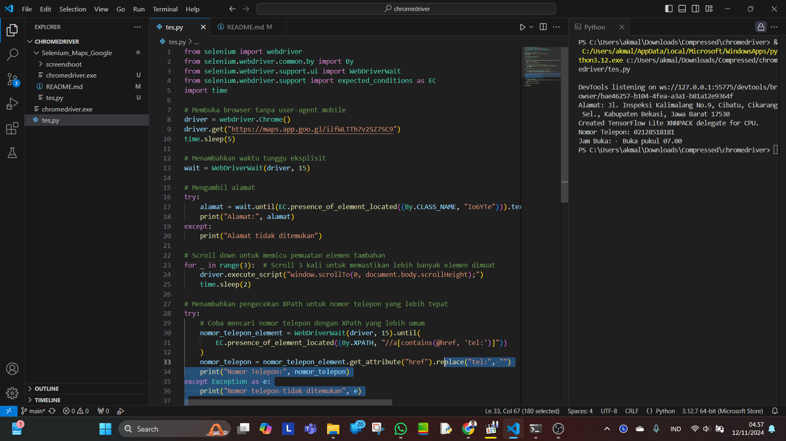

Langsung saja, pertama - tama, kalian siapkan link maps yang mau kalian ambil datanya.

saya ambil contoh link maps kampus tercinta saya "UNIVERSITY OF PELITA BANGSA". https://maps.app.goo.gl/iifWLTTh7v2SZ7SC9.

Setelah semua sudah siap kita kita download crome drive atau kalian basa ambil file yang sudah saya siapkan diatas dan kode pythonnya kalian bisa coba langsung karna saya juga males jelasin panjang lebar intinya siu bay🫡🫡🫡.

## SIMULASI Runing
